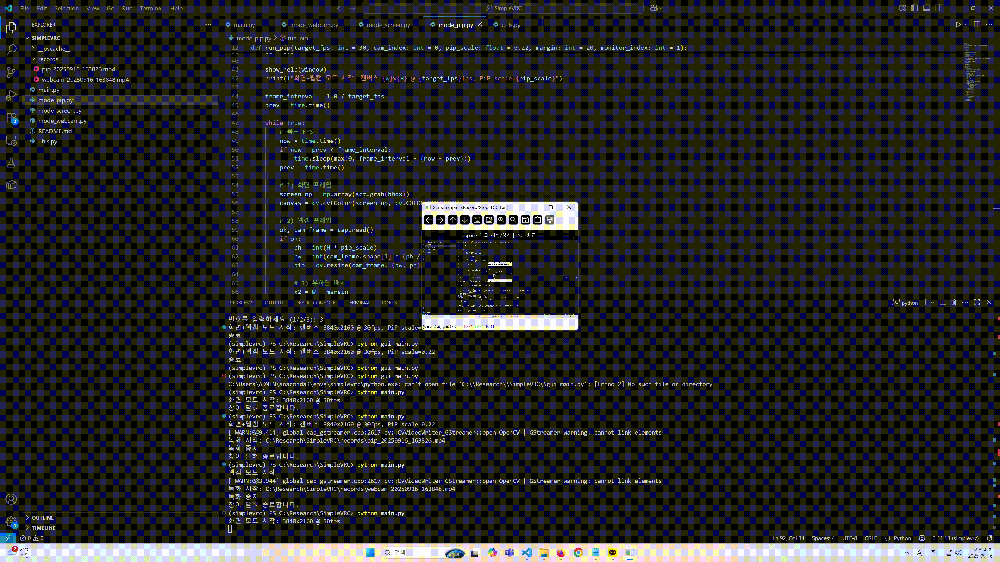

# simplevrc : simple python programs for recording webcam or screen or pip

A simple Python program that can record the **webcam**, the **screen**, or the **screen with a picture-in-picture (PiP) webcam overlay**.  
Built with `OpenCV` and `MSS`. You can start/stop recording with **Space**, and exit with **ESC**.  

---

## 1) Examples

<p align="center">
  <figure>
    
    <figcaption align="center">Webcam Recording</figcaption>
  </figure>
  <figure>
    
    <figcaption align="center">Screen Recording</figcaption>
  </figure>
  <figure>
    
    <figcaption align="center">PiP Recording</figcaption>
  </figure>
</p>

---

## 2) Features
- **Recording modes**
  - Screen recording
  - Webcam recording
  - Screen + webcam (PiP) recording, with webcam overlay at the bottom-right
- **Convenience**
  - Red circle + timer overlay during recording
  - Automatically saves videos to `records/` with timestamped filenames
  - GUI launcher (`main.py`) for easy mode selection

---

## 3) Installation

### 3-1) Create Conda environment
```bash
conda create -n recorder python=3.10 -y
conda activate recorder
```
### 3-2) Install dependencies
```bash
conda install -c conda-forge opencv
pip install mss
```

---

## 4) Start ANDControl

### 4-1) Start
```bash
python main.py
```

### 4-2) Control
- **Space** → Start/stop recording  
- **ESC** → Exit program  
- **X button** (close window) → Exit safely

---